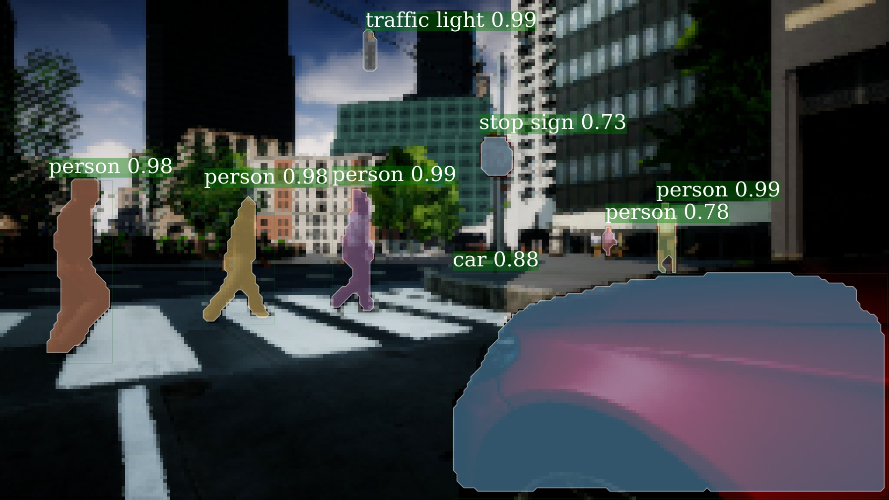

# AirsimDetectron
Airsim integraded with Detectron.

Detectron is Facebook AI Research's software system that implements state-of-the-art object detection algorithms, including [Mask R-CNN](https://arxiv.org/abs/1703.06870). It is written in Python and powered by the [Caffe2](https://github.com/caffe2/caffe2) deep learning framework.

  
  
Example Mask R-CNN output.

## Introduction

Airsim out of Microsoft Research (MSR AIR)is a Unreal plugin that can simply be dropped in
to any Unreal environment you want. Detectron Facebook (FAIR) research platform for object detection research, implementing popular 
algorithms like Mask R-CNN and RetinaNet. The idea for this project is to use state of the art objection 
detection in a state of the art simulator. The vision is that other researchers and engineers 
can use this project as a foundation for things like autonomous navigation. 

## Installation

Install Unreal Engine 4.18 (Need for Airsim)

Please find installation instructions for Caffe2 and Detectron in INSTALL.md (Needed for Detectron).

**[Usefu](https://www.nvidia.com/en-us/data-center/gpu-accelerated-applications/tensorflow/)**
## Quick Start: Using AirDetectron

After installation, please see [`GETTING_STARTED.md`](GETTING_STARTED.md) for brief tutorials covering inference and training with Detectron.

## References

**Original Repos:**  
More information can be found about Airsim and Detectron on the following repositories.   
[Airsim](https://github.com/Microsoft/AirSim)  
[Detectron](https://github.com/facebookresearch/Detectron) 

